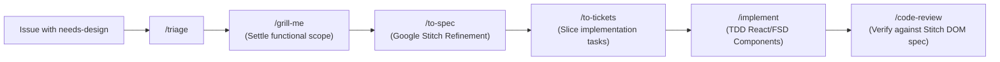

# Google Stitch UI Refinement Playbook

This playbook establishes the protocol for integrating **Google Stitch** into the Watchpoint feature refinement lifecycle. It defines when to involve Stitch, how to ensure design system consistency, how to execute prompt sessions via MCP or Web UI, and how to hand off deterministic UI specifications for implementation.

---

## 1. Trigger Policy & The `needs-design` Label

| Condition | Action |
| :--- | :--- |
| **New UI Views or Multi-Component Surfaces** | Apply `needs-design` during `/triage`. Stitch refinement is mandatory. |
| **Major Layout Overhauls or Interaction Redesigns** | Apply `needs-design`. Stitch refinement is mandatory. |
| **High Visual/UX Ambiguity** | Apply `needs-design` during `/grill-me` if visual models need alignment. |
| **Minor CSS Tweaks, Text Changes, Bug Fixes** | Do **not** apply `needs-design`. Proceed directly through `/to-spec`. |

---

## 2. Pipeline Placement

Stitch refinement sits within **`/to-spec`**:



1. **`/grill-me`** resolves functional requirements, user journeys, data contracts, and interactive states first.
2. **`/to-spec`** assembles the Refinement Input Packet, generates/updates screens in Stitch, pulls the HTML/DOM export, and maps components to FSD layers.
3. **`/to-tickets`** slices implementation sub-issues only after the visual export and FSD mapping are recorded in the issue.

---

## 3. The Refinement Input Packet

Before prompting Google Stitch, assemble these four inputs:

1. **User Story & Objectives**: What user problem does this screen solve?
2. **Interactive States**: Default, Hover, Loading, Error, Empty, and Active states.
3. **Design System Anchor**: `docs/design/DESIGN.md` (colors, typography, border radiuses).
4. **Existing Component Primitives**: Names of `shared/ui` components to reuse (e.g. `Button` variants, `Input`, `Card`).

---

## 4. Master Living Workspace Model in Stitch

To prevent visual drift across screens:
- Maintain a single **Watchpoint Master Project** in Google Stitch.
- **Design System Upload**: Ensure `docs/design/DESIGN.md` is uploaded and synchronized to the project via `@google/stitch-mcp` (`stitch_upload_design_md`) or the Stitch Web UI.
- **Feature Screens as Pages**: New features are created as new screens/pages within the *same* master project canvas, giving Stitch immediate visual memory of existing screens.

---

## 5. 3-Part Delta Prompting Recipe

When prompting Stitch (via MCP or Web UI), always structure prompts in three clear sections:

```markdown
### 1. Design System Context
Adopt the Watchpoint design system (Tailwind v4 semantic tokens):
- Dark mode canvas (`bg-background: #0a0a0a`, `text-foreground: #ededed`)
- Semantic tokens: `bg-card`, `bg-primary`, `bg-secondary`, `bg-muted`, `border-input`
- Font: `font-sans` for labels, `font-mono` for timestamps/metrics
- Icons: `lucide-react` naming conventions
- Strict requirement: Use standard Tailwind utility classes only. No arbitrary hex codes.

### 2. Base Screen / Visual Anchor
Reference Screen: [Name of existing screen in workspace, e.g. "VOD Player Default View"]
Context: [Brief snippet or layout description of the adjacent/parent container]

### 3. Isolated Delta / Feature Request
Create a new screen/component for [Feature Name]:
- Layout: [e.g. Right-hand sidebar panel with collapsible marker list]
- Interactive States to include:
  1. Default: Populated marker cards with timestamps
  2. Hover: Highlighted marker row with edit/delete icon buttons
  3. Empty: "No markers set" state with a primary "Add Marker" button
```

---

## 6. Stitch MCP Server Tool Reference

When using `@google/stitch-mcp` in agent sessions:

| MCP Tool | Purpose in Workflow |
| :--- | :--- |
| `stitch_upload_design_md` | Synchronize `docs/design/DESIGN.md` tokens into the Stitch workspace. |
| `stitch_list_projects` | Locate the master Watchpoint project ID. |
| `stitch_generate_screen_from_text` | Generate a new feature screen using the 3-part prompt recipe. |
| `stitch_get_screen` | Fetch semantic HTML, Tailwind styling, and metadata from a generated screen. |
| `stitch_edit_screens` | Apply targeted delta modifications to an existing screen. |

---

## 7. Issue Specification Structure & Deterministic Export

During `/to-spec`, embed the Stitch refinement results directly into the GitHub issue body:

```markdown
## 🎨 Visual Design Specification (Google Stitch)

- **Stitch Project**: [Watchpoint Master Canvas](https://stitch.withgoogle.com/projects/<project-id>)
- **Screen URL**: [Feature Screen Reference](https://stitch.withgoogle.com/projects/<project-id>/screens/<screen-id>)

<details>
<summary>🎨 Reference Stitch HTML/DOM Export (Click to expand)</summary>

```html
<!-- Paste semantic HTML & Tailwind classes retrieved via stitch_get_screen -->
<div class="flex flex-col h-full bg-card border border-input rounded-lg p-4">
  <div class="flex items-center justify-between pb-3 border-b border-input">
    <h3 class="text-sm font-semibold text-foreground">Timeline Markers</h3>
    <button class="inline-flex items-center justify-center h-8 px-3 text-xs font-medium rounded-md bg-primary text-primary-foreground shadow hover:bg-primary/90">
      Add Marker
    </button>
  </div>
  ...
</div>
```
</details>

### FSD Layer Mapping
- `src/features/timeline-markers/ui/marker-list.tsx`: Container panel and list orchestration.
- `src/entities/marker/ui/marker-card.tsx`: Individual marker item with timestamp and label.
- `src/shared/ui/button.tsx`: Primary and icon button controls.
- `src/shared/ui/badge.tsx`: Category pills.
```

---

## 8. Pull Request & Review Verification

When an agent implements the feature (`/implement`):

1. **PR Description**: Include a `### 🎨 Design Spec` section linking to the issue's Stitch spec and screen URL.
2. **Review Checklist (`/code-review`)**:
   - Do component class names use semantic tokens (`bg-primary`, `text-muted-foreground`) rather than arbitrary hex values?
   - Do UI states match the interactive states defined in the Stitch DOM export?
   - Are icons imported from `lucide-react`?
   - Does component architecture respect FSD layer boundaries (`features/`, `entities/`, `shared/ui`)?

---

## 9. In-Flight Screen Versioning Policy

- **Minor Tweaks**: Adjustments to padding, typography weights, or copy post-spec occur directly in code without re-running Stitch.
- **Structural Revisions**: If PR review or user feedback requires a layout overhaul or new multi-state interaction, create a versioned screen (e.g. `[Feature] Markers Panel - v2`) in the Stitch master workspace and update the issue spec export before updating the PR code.
