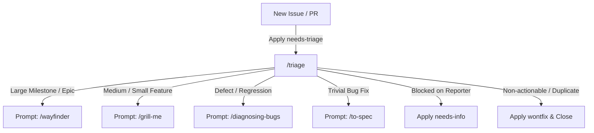
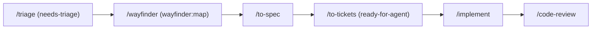
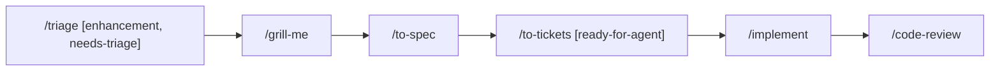
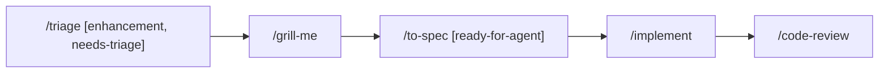
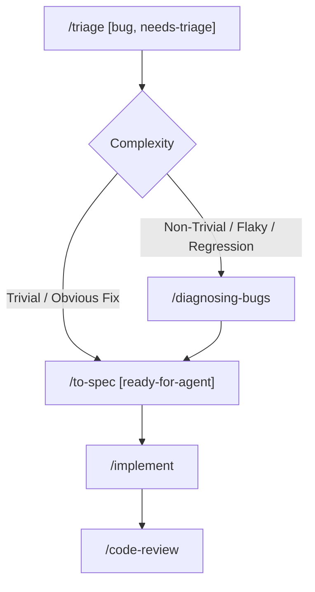
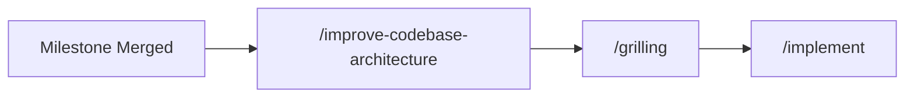
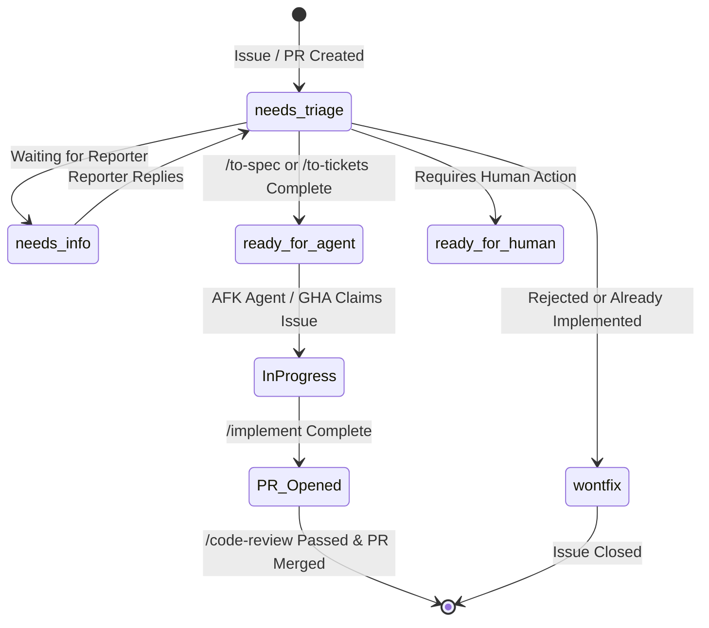
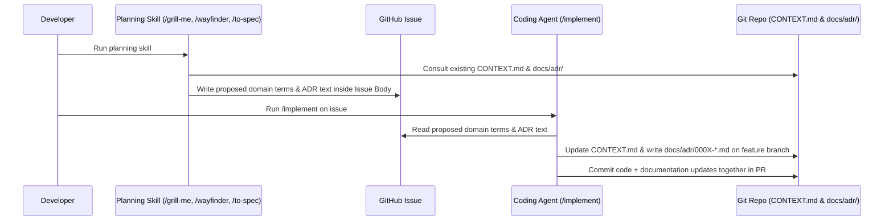

# Engineering Workflows & Skill Sequences

This guide defines how skills link together into sequential workflows for different scopes of work, and what skill to trigger at each step.

---

## 1. Universal Starting Point: `/triage`

All work (new issues, bugs, and feature requests) starts with `/triage`. Triage assigns category labels (`bug`, `enhancement`) and initiates the state machine with `needs-triage`.

---

## 2. Workflows by Scope

### Milestone Workflow (High Ambiguity / Epic)

1. **Triage**: Run `/triage` on the epic issue. Agent prompts: *"This is a milestone with significant fog. Run `/wayfinder`."*
2. **Wayfinding**: Run `/wayfinder` to create the map issue (labeled `wayfinder:map`) and create child decision tickets labeled by type (`wayfinder:research`, `wayfinder:prototype`, `wayfinder:grilling`, `wayfinder:task`). AFK research tickets run via `/research` subagents; HITL decision tickets are resolved with the user.
3. **Specification**: When all fog is resolved on the map, the agent prompts: *"Map destination reached. Run `/to-spec` for each feature."*
4. **Ticket Slicing**: Run `/to-tickets` on each specification to produce dependency-wired issues labeled `ready-for-agent`.
5. **Implementation**: Run `/implement` on each unblocked child ticket labeled `ready-for-agent`.
6. **Review**: Run `/code-review` on opened PRs.

---

### Medium Feature Workflow (Multi-Ticket)

1. **Triage**: Run `/triage` to classify as `[enhancement, needs-triage]`. Agent prompts: *"Run `/grill-me` on #[issue-number]."*
2. **Grilling**: Run `/grill-me` (or `/grill-with-docs`) to answer trade-off and edge-case questions. Once answered, the agent prompts: *"Decisions settled. Run `/to-spec`."*
3. **Specification**: Run `/to-spec` to publish the implementation spec onto the issue body. Agent prompts: *"Spec published. Run `/to-tickets` to split into tasks."*
4. **Ticket Slicing**: Run `/to-tickets` to generate sub-issues labeled `ready-for-agent`.
5. **Implementation**: Run `/implement` on unblocked child tickets in dependency order.
6. **Review**: Run `/code-review` on opened PRs.

---

### Small Feature Workflow (Single Session)

1. **Triage**: Run `/triage` to classify as `[enhancement, needs-triage]`. Agent prompts: *"Run `/grill-me` for a quick round."*
2. **Grilling**: Run 1 quick round of `/grill-me`. Once answered, the agent prompts: *"Run `/to-spec`."*
3. **Specification**: Run `/to-spec` to record the compact specification directly on the issue and apply the `ready-for-agent` label. Agent prompts: *"Spec ready. Run `/implement`."*
4. **Implementation**: Run `/implement` to create branch, write tests first with TDD, and open a PR.
5. **Review**: Run `/code-review` on the PR.

---

### Bug Fix Workflow

1. **Triage**: Run `/triage` to verify the bug against local code and tag `[bug, needs-triage]`.
   - **For complex / flaky / performance bugs**: The agent prompts: *"Run `/diagnosing-bugs` to build a tight feedback loop and find root cause."*
   - **For obvious bugs**: The agent prompts: *"Root cause clear. Run `/to-spec` to define the test seam."*
2. **Diagnosis (if needed)**: Run `/diagnosing-bugs` to build the red feedback loop, isolate minimal repro, and identify the root cause. Agent prompts: *"Diagnosis confirmed. Run `/to-spec`."*
3. **Specification**: Run `/to-spec` to lock down the test seam and regression criteria, applying the `ready-for-agent` label. Agent prompts: *"Run `/implement`."*
4. **Implementation**: Run `/implement` to write the failing test, apply fix, confirm green, and open PR.
5. **Review**: Run `/code-review` on the PR.

---

### Post-Milestone Review Workflow

1. **Review**: After merging a milestone to `main`, run `/improve-codebase-architecture`.
2. **Select Candidate**: Review the generated visual report and select a refactoring candidate. Agent prompts: *"Run `/grilling` on chosen module refactor."*
3. **Grill**: Run `/grilling` to lock the new deep module interface and test seams.
4. **Implement**: Run `/implement` to execute the refactoring PR.

---

## 3. State Tracking Labels & GHA Automation

The skill ecosystem uses GitHub labels to track issue and PR lifecycle state across manual sessions and GitHub Actions (GHA) automation. See [triage-labels.md](triage-labels.md) for the canonical repository mappings.

### Canonical Label Taxonomy

| Category / Role | Label Name | Purpose & Workflow Trigger |
| --- | --- | --- |
| **Category** | `bug` | Identifies defects, crashes, or regressions. |
| **Category** | `enhancement` | Identifies new features, improvements, or refactors. |
| **Triage State** | `needs-triage` | Entry point for newly filed issues and external PRs awaiting evaluation. |
| **Triage State** | `needs-info` | Issue blocked waiting on reporter/author feedback. |
| **Execution State** | `ready-for-agent` | Specification/acceptance criteria complete. Triggers AFK automated agent workflows in GHA or indicates an unblocked task ready for `/implement`. |
| **Execution State** | `ready-for-human` | Requires human judgment, external dashboard access, secrets, or manual UI signoff. |
| **Resolution** | `wontfix` | Closed as out of scope, invalid, or already implemented. |
| **Wayfinding** | `wayfinder:map` | Index issue representing a multi-ticket milestone map. |
| **Wayfinding** | `wayfinder:research` | AFK research ticket executed via parallel `/research` subagents. |
| **Wayfinding** | `wayfinder:prototype` | HITL prototyping ticket exploring UX or technical design spikes. |
| **Wayfinding** | `wayfinder:grilling` | HITL conversational alignment ticket for architectural trade-offs. |
| **Wayfinding** | `wayfinder:task` | Prerequisite task unblocking decisions (HITL or AFK). |

### Lifecycle State Transitions in GHA

---

## 4. Domain Model & ADR Synchronization Rule

- **During Planning (`/grilling`, `/wayfinder`, `/to-spec`)**: Do not edit git files. Document proposed `CONTEXT.md` terms and ADR details directly inside the GitHub issue under `## Proposed Domain & ADR Updates`.
- **During Implementation (`/implement`)**: The implementing agent reads the documented updates from the issue, updates `CONTEXT.md`, and creates the new `docs/adr/000X-*.md` file directly on the feature branch.
