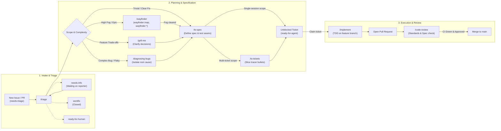
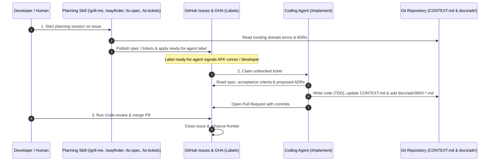

# Engineering Workflows & Skill Sequences

This guide defines how skills link together into sequential workflows for different scopes of work, and how GitHub labels track execution state across manual sessions and GitHub Actions (GHA) automation.

---

## 1. Master Workflow Blueprint

The following master diagram depicts the unified, Left-to-Right (LR) progression of any issue or PR from initial intake and triage, through branching planning pathways, converging at the `ready-for-agent` gate, and flowing into implementation, review, and merge:

---

## 2. Workflows by Scope

### Milestone Workflow (High Ambiguity / Epic)
1. **Triage**: Run `/triage` on the epic issue. Agent prompts: *"This is a milestone with significant fog. Run `/wayfinder`."*
2. **Wayfinding**: Run `/wayfinder` to create the map issue (`wayfinder:map`) and child decision tickets (`wayfinder:research`, `wayfinder:prototype`, `wayfinder:grilling`, `wayfinder:task`). AFK research tickets run via `/research` subagents; HITL decision tickets resolve with the user.
3. **Specification**: When fog is cleared, run `/to-spec` for each feature.
4. **Ticket Slicing**: Run `/to-tickets` to generate sub-issues labeled `ready-for-agent`.
5. **Implementation**: Run `/implement` on unblocked tickets in dependency order.
6. **Review**: Run `/code-review` on opened PRs.

### Medium Feature Workflow (Multi-Ticket)
1. **Triage**: Run `/triage` to classify as `[enhancement, needs-triage]`.
2. **Grilling**: Run `/grill-me` (or `/grill-with-docs`) to settle trade-offs and edge cases.
3. **Specification**: Run `/to-spec` to record the full specification in the issue.
4. **Ticket Slicing**: Run `/to-tickets` to split into vertical tracer-bullet sub-issues labeled `ready-for-agent`.
5. **Implementation**: Run `/implement` on unblocked child tickets in dependency order.
6. **Review**: Run `/code-review` on opened PRs.

### Small Feature Workflow (Single Session)
1. **Triage**: Run `/triage` to classify as `[enhancement, needs-triage]`.
2. **Grilling**: Run 1 quick round of `/grill-me`.
3. **Specification**: Run `/to-spec` to record compact specification and apply `ready-for-agent`.
4. **Implementation**: Run `/implement` (TDD, test seams, open PR).
5. **Review**: Run `/code-review` on opened PRs.

### Bug Fix Workflow
1. **Triage**: Run `/triage` to verify bug against local code and tag `[bug, needs-triage]`.
2. **Diagnosis (if needed)**: For complex/flaky bugs, run `/diagnosing-bugs` to build the red reproduction feedback loop and identify root cause.
3. **Specification**: Run `/to-spec` to lock down test seam and regression criteria (`ready-for-agent`).
4. **Implementation**: Run `/implement` to write failing test, apply fix, verify green, and open PR.
5. **Review**: Run `/code-review` on opened PRs.

---

## 3. State Tracking Labels & GHA Automation

The skill ecosystem uses GitHub labels to track issue and PR lifecycle state across manual sessions and GitHub Actions (GHA) automation. See [triage-labels.md](triage-labels.md) for canonical repository mappings.

### Canonical Label Taxonomy

| Category / Role | Label Name | Purpose & Workflow Trigger |
| --- | --- | --- |
| **Category** | `bug` | Identifies defects, crashes, or regressions. |
| **Category** | `enhancement` | Identifies new features, improvements, or refactors. |
| **Triage State** | `needs-triage` | Entry point for newly filed issues and external PRs awaiting evaluation. |
| **Triage State** | `needs-info` | Issue blocked waiting on reporter/author feedback. |
| **Execution State** | `ready-for-agent` | Specification/acceptance criteria complete. Triggers AFK automated agent workflows in GHA or indicates an unblocked task ready for `/implement`. |
| **Execution State** | `ready-for-human` | Requires human judgment, external dashboard access, secrets, or manual UI signoff. |
| **Resolution** | `wontfix` | Closed as out of scope, invalid, or already implemented. |
| **Wayfinding** | `wayfinder:map` | Index issue representing a multi-ticket milestone map. |
| **Wayfinding** | `wayfinder:research` | AFK research ticket executed via parallel `/research` subagents. |
| **Wayfinding** | `wayfinder:prototype` | HITL prototyping ticket exploring UX or technical design spikes. |
| **Wayfinding** | `wayfinder:grilling` | HITL conversational alignment ticket for architectural trade-offs. |
| **Wayfinding** | `wayfinder:task` | Prerequisite task unblocking decisions (HITL or AFK). |

---

## 4. Master Domain Model, ADR & Code Sync Diagram

- **During Planning (`/grilling`, `/wayfinder`, `/to-spec`)**: Do not edit git files directly. Document proposed `CONTEXT.md` terms and ADR details inside the GitHub issue under `## Proposed Domain & ADR Updates`.
- **During Implementation (`/implement`)**: The implementing agent reads the documented updates from the issue, updates `CONTEXT.md`, and creates the new `docs/adr/000X-*.md` file directly on the feature branch.
