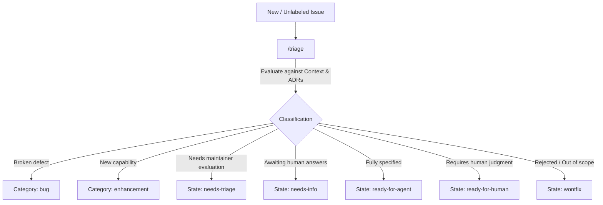
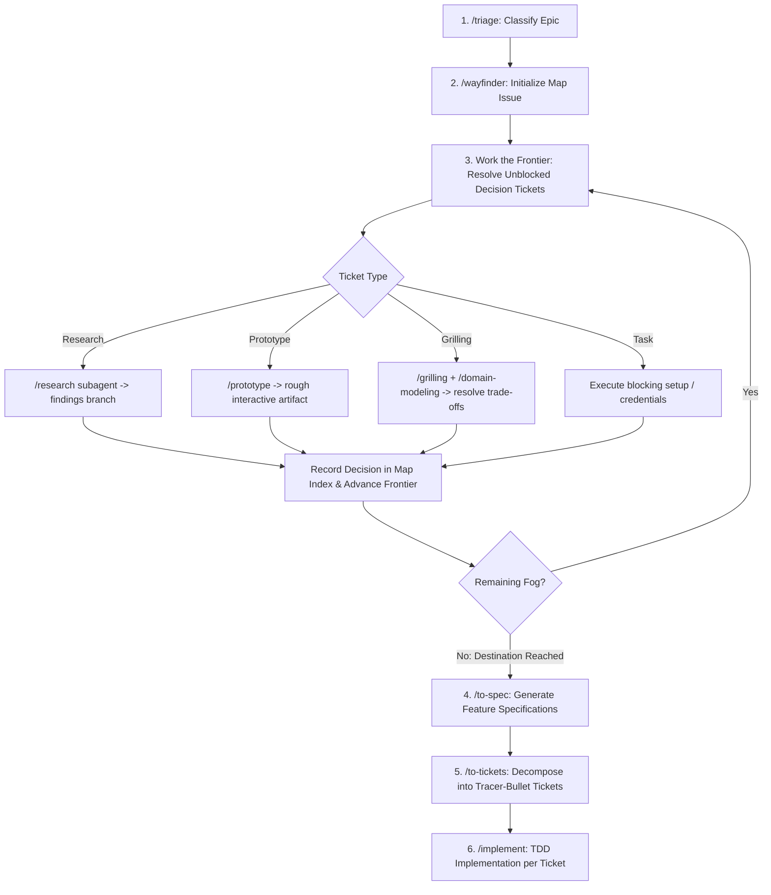
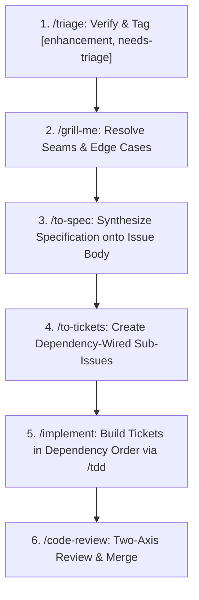
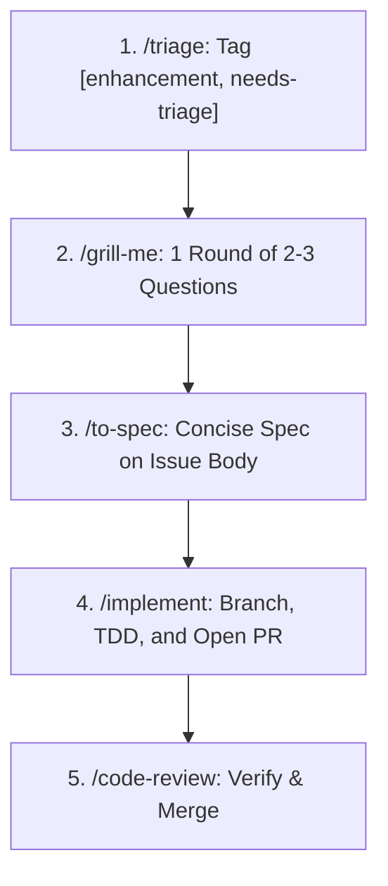
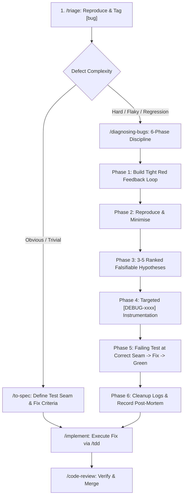
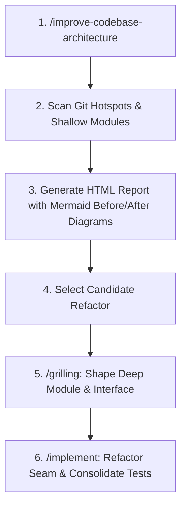
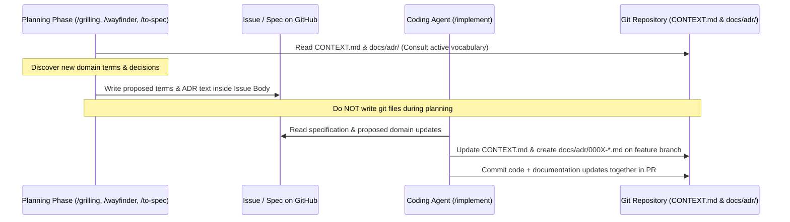

# Engineering Workflows & Playbooks

Procedural playbooks for planning, refining, diagnosing, and executing changes across the repository.

---

## Universal Entry Point: Triage

Every issue or external request enters through `/triage` before any specification or coding begins.

### Pre-Triage Reference Documents

The triage agent must consult the following sources in order before applying roles:
1. `docs/agents/issue-tracker.md` — Issue tracker CLI operations and external PR triage scope.
2. `docs/agents/triage-labels.md` — Canonical category and state role mappings.
3. `CONTEXT.md` (via `docs/agents/domain.md`) — Ubiquitous language, entity glossary, and system boundaries.
4. `docs/adr/` — Architecture Decision Records; do not propose changes that contradict active ADRs without explicit flagging.
5. `.out-of-scope/*.md` (if present) — Previously rejected proposals.

---

## 1. Large Milestone Workflow (High Ambiguity / Epics)

Use when work exceeds a single context window and contains unknown dependencies, unselected libraries, or architectural fog of war.

### Execution Steps
1. **Initialize Map**: Run `/wayfinder` to define the Destination and sketch the in-scope fog into `Not yet specified`.
2. **Work the Frontier**: Identify open, unblocked child tickets (`Blocked by` resolved). Work one ticket per session:
   - `research` (AFK): Dispatch `/research` subagents against documentation and APIs.
   - `prototype` (HITL): Construct throwaway UI/logic to resolve behavioral ambiguity.
   - `grilling` (HITL): Run interactive technical interview to resolve design trade-offs.
   - `task` (HITL/AFK): Complete blocking infrastructure setup.
3. **Advance Frontier**: Post resolution comment, close the ticket, and append the gist to `Decisions so far`.
4. **Handoff to Specs**: When no fog remains, run `/to-spec` on the settled architecture to produce mid-sized feature specs.
5. **Decompose & Implement**: Run `/to-tickets` on each spec and build sequentially with `/implement`.

### Completion Criterion
The Map issue is closed with zero open child tickets, all decisions indexed in `Decisions so far`, and corresponding feature specs generated.

---

## 2. Medium Feature Workflow (Multi-Ticket Slices)

Use for well-scoped capabilities requiring multiple modules or layers (e.g. database migration + server action + UI component).

### Execution Steps
1. **Triage**: Check codebase for existing implementations or active ADR constraints.
2. **Grill**: Run `/grill-me` (or `/grill-with-docs`) for 1–2 rounds to settle edge cases, data structures, and test seams.
3. **Spec**: Run `/to-spec` to generate problem statement, user stories, implementation decisions, test seams, and out-of-scope boundaries directly onto the issue body.
4. **Ticket Slicing**: Run `/to-tickets` to publish child issues with native dependency links (`Blocked by: #...`) labeled `ready-for-agent`.
5. **Implement**: Execute each unblocked ticket with `/implement` (TDD loop + standards validation).
6. **Review**: Run `/code-review` on opened PRs to verify standards and acceptance criteria.

### Completion Criterion
All child tickets closed, each backed by a merged PR passing full test suite and two-axis review.

---

## 3. Small Feature Workflow (Single Session)

Use for compact, isolated enhancements (e.g. keyboard shortcut, button variant, standalone utility).

### Execution Steps
1. **Triage**: Confirm feature boundary and absence of redundancy.
2. **Grill**: Run 1 quick round of `/grill-me` to lock down inputs, outputs, and failure states.
3. **Spec**: Run `/to-spec` directly on the issue.
4. **Implement**: Run `/implement` to branch, write failing test, satisfy implementation, and open PR.
5. **Review**: Verify with `/code-review`.

### Completion Criterion
A single merged PR satisfying all spec acceptance criteria with sub-50ms unit tests.

---

## 4. Bug Triage, Diagnosis & Fix Workflow

Use for runtime exceptions, broken interaction seams, data corruption, or performance regressions.

### The 6-Phase `/diagnosing-bugs` Discipline

1. **Phase 1 — Build a Feedback Loop**:
   - Construct one fast, deterministic, agent-runnable command (test runner, curl script, Playwright scenario) that drives the bug code path and asserts on the exact user symptom.
   - Do NOT inspect code to form theories before this command exists.
2. **Phase 2 — Reproduce & Minimise**:
   - Run the loop and confirm RED on the exact symptom described.
   - Cut non-load-bearing inputs, configuration, and callers one by one until only essential trigger elements remain.
3. **Phase 3 — Hypothesise**:
   - Produce 3–5 falsifiable hypotheses in format: *"If X is the cause, changing Y will make the bug disappear / changing Z will make it worse."*
   - Rank by likelihood before testing.
4. **Phase 4 — Instrument**:
   - Insert targeted probes mapping to specific hypotheses.
   - Tag all debug statements with a unique prefix (e.g. `[DEBUG-4f1a]`) to guarantee complete removal.
5. **Phase 5 — Fix & Regression Test**:
   - Convert the minimal repro into a permanent test at the highest correct public seam.
   - Apply fix, observe GREEN loop, and re-run against original un-minimised repro.
6. **Phase 6 — Cleanup & Post-Mortem**:
   - Strip all `[DEBUG-xxxx]` instrumentation.
   - Document verified root cause in PR commit message.
   - If missing seams or tight coupling caused the bug, hand off findings to `/improve-codebase-architecture`.

### Completion Criterion
The feedback loop passes GREEN, the permanent regression test passes, all temporary instrumentation is purged, and root cause is documented in commit history.

---

## 5. Architectural Health Check Workflow

Use periodically after landing major milestones to detect shallow modules, coupling friction, or testing seam drift.

### Execution Steps
1. **Trigger Scan**: Run `/improve-codebase-architecture` across recent git commit hot spots.
2. **Inspect Report**: Open the generated visual report (`/tmp/architecture-review-<timestamp>.html`) to examine side-by-side Before/After architectural structures and testability ratings.
3. **Select Candidate**: Pick a candidate marked `Strong` or `Worth exploring`.
4. **Refactor**: Run `/grilling` to lock the new deep module interface, then execute via `/implement`.

### Completion Criterion
The refactored module passes the deletion test (concentrates complexity behind a simple interface) with simplified, isolated tests.

---

## Domain Model & ADR Synchronization Rules

1. **Planning Phase**:
   - Read `CONTEXT.md` and `docs/adr/` to respect existing architecture.
   - When new domain terms or architectural decisions emerge, **do not edit git files immediately**.
   - Record the proposed `CONTEXT.md` definitions and ADR text directly in the GitHub Issue body under `## Proposed Domain & ADR Updates`.
2. **Implementation Phase**:
   - The `/implement` agent reads the domain and ADR text from the issue.
   - The agent updates `CONTEXT.md` and writes the new `docs/adr/000X-*.md` file directly on the working branch.
   - Documentation and code land together in `main` via the pull request.
