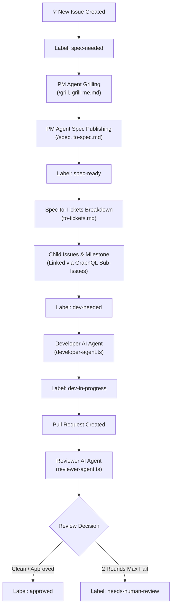

# AI Refinement, Development, and Review Lifecycle

This repository implements an automated, multi-agent AI Software Development Lifecycle (SDLC) driven by GitHub Actions, Google Gemini 3.6 Flash, and specialized agent skill instructions.

---

## 🏛️ Architecture Overview & State Machine

The workflow connects Product Management, Development, and Code Review into a cohesive, low-noise state machine.



---

## 🏷️ Canonical 6-Label Taxonomy

The repository operates on a consolidated, 6-label taxonomy to minimize noise and maintain clear state ownership:

| Label | Description | Owner |
| :--- | :--- | :--- |
| `spec-needed` | Issue requires specification refinement, grilling, or clarification. | PM AI Agent |
| `spec-ready` | Formal specification synthesized and published on issue body. | PM AI Agent |
| `dev-needed` | Unblocked developer ticket ready for implementation. | Developer AI Agent |
| `dev-in-progress` | Developer AI Agent is actively working on the ticket. | Developer AI Agent |
| `approved` | Pull request passed automated 2-axis quality and spec review. | Reviewer AI Agent |
| `needs-human-review` | Iteration limit reached (2 rounds) or explicit escalation; requires maintainer review. | Human Maintainer |

---

## 🤖 The 3 AI Agents

### 1. Product Manager AI Agent (`scripts/agent-planner.ts` & `scripts/agent-itemizer.ts`)
- **Triggers:** Label `spec-needed`, comment commands (`/grill`, `/spec`, `/to-spec`).
- **Grilling Phase:** Interactively interviews the author on requirements, scope, edge cases, and UI/API contracts.
- **Spec Publishing Phase:** Synthesizes discussion into a standardized specification and updates the issue body, applying `spec-ready`.
- **Ticket Breakdown Phase:** Converts the published spec into an ordered set of child issues under a parent milestone. Links native GitHub sub-issues (`addSubIssue`) and blocked-by dependencies (`addBlockedBy`) via GraphQL. Unblocked tickets are tagged with `dev-needed`.

### 2. Developer AI Agent (`scripts/agent-developer.ts`)
- **Triggers:** Label `dev-needed`, issue assignment, or comment commands (`/dev`, `/implement`).
- **Quiet State Transition:** Removes `dev-needed` and applies `dev-in-progress` without generating bot comment noise.
- **Development Standards:**
  - **Feature-Sliced Design (FSD v2.1):** All UI, business logic, and server actions reside in `src/_pages/<slice-name>/`. Next.js `app/` routes remain pure barrel re-exports (`export { Page as default } from "@/_pages/..."`).
  - **Test-Driven Development (TDD):** Red -> Green -> Refactor workflow. Every unit test must be structured in **Arrange-Act-Assert (AAA)** blocks and execute in <50ms.
- **Completion:** Posts implementation summary and target branch name (`dev/issue-<number>-<slice>-<title>`).

### 3. Reviewer AI Agent (`scripts/agent-reviewer.ts`)
- **Triggers:** Pull Request actions (`opened`, `synchronize`, `reopened`), or comment commands (`/review`, `/re-review`).
- **Two-Axis Audit:**
  1. **Standards Axis:** Enforces FSD architecture (`steiger`), Thermo-Nuclear code quality, zero spaghetti conditionals, clean boundary abstractions, and AAA unit tests.
  2. **Spec Axis:** Verifies feature delivery against issue requirements.
- **Thermo-Nuclear Call-Site Signature Audit:** Never infers implementation details. Cross-references function parameter signatures against every invocation site in the diff to ensure parameter propagation.
- **Permission Fallback Handling:** If GitHub Actions approval permission is restricted (`HTTP 422`), falls back gracefully from `APPROVE` to `COMMENT` review event while applying the `approved` label.
- **2-Round Iteration Limit:** Max 2 automated review rounds. If blocking issues persist after Round 2, escalates to `needs-human-review`. Re-triggering via `/review` comment or pushing new commits (`synchronize`) resets escalation back to Round 2.

---

## ⌨️ Command & Slash Reference

| Command | Target | Description |
| :--- | :--- | :--- |
| `/grill` | Issue | Asks PM AI Agent to begin or continue interactive requirement grilling. |
| `/spec` or `/to-spec` | Issue | Triggers PM AI Agent to publish formal feature specification to issue description. |
| `/dev` or `/implement` | Issue | Triggers Developer AI Agent to implement ticket. |
| `/review` or `/re-review` | Pull Request | Re-runs Reviewer AI Agent or resets escalation state back to Round 2. |

---

## 🧪 Local & Automated Verification Pipeline

All agents must adhere to the non-negotiable verification suite. Run locally prior to submitting changes:

```bash
# Complete Pre-Merge Verification
bun run validate
```

Sub-commands run by `validate`:
- `bun run check:types` – TypeScript strict type check (`tsc --noEmit`).
- `bun run check:all` – Biome linting and formatting.
- `bun run check:architecture` – Steiger FSD v2.1 architectural compliance.
- `bun run test:coverage` – Vitest unit tests with **100% statement, branch, function, and line coverage** enforcement.
- `bun run build` – Next.js production build compilation.

---

## 🎨 Google Stitch Design Mockup Workflow

To ensure seamless, interactive page design evolution without full-page redesigns:

1. **Design in Google Stitch:** Create the V1 layout or select a specific area to iterate on (e.g. adding a search bar component) in the Google Stitch canvas (`stitch.withgoogle.com`).
2. **Embed in Issue:** Export the HTML/Tailwind mockup and paste it directly into the issue description wrapped in a `<!-- design-mockup -->` block:
   ```markdown
   <!-- design-mockup -->
   ```html
   <div class="header">Mockup HTML</div>
   ```
   ```
3. **Automated Extraction:** When the Developer AI Agent starts work on the ticket (`dev-needed`), it automatically extracts the mockup HTML and writes it to `docs/designs/<slice-name>/layout.html` on the local git branch.
4. **Side-by-Side PR Review:** The layout HTML and the matching FSD React components are committed to git in the same PR, allowing the Reviewer AI Agent and human maintainers to audit structural and visual layout changes side-by-side.
